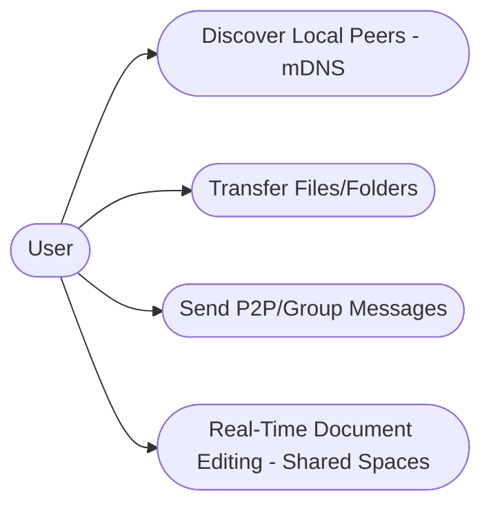
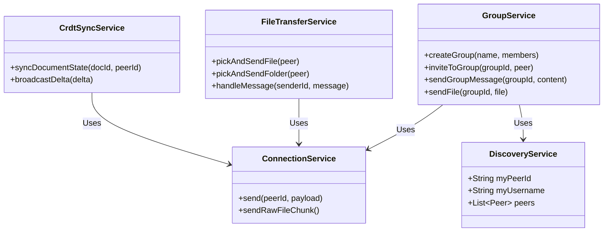
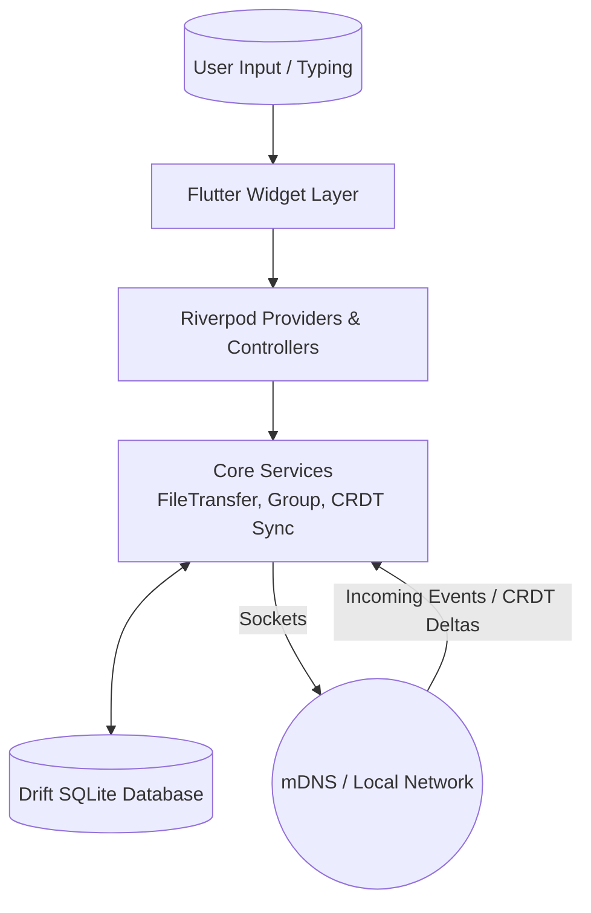
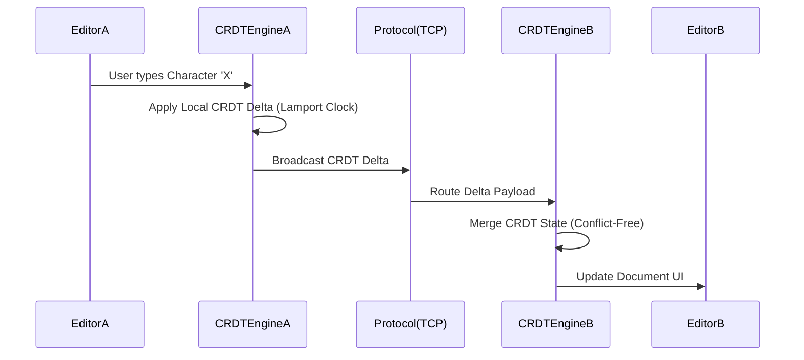
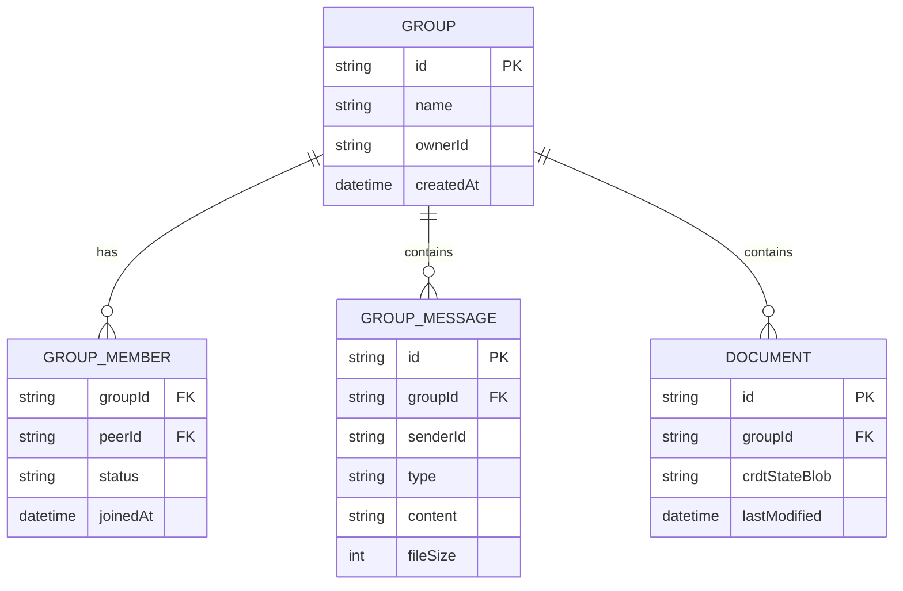

# Stoa: Software Architecture Document

## 1. Selected Architecture
**Architecture Model: Event-Driven Architecture (P2P)**

**Explanation:**
For Stoa, a decentralized peer-to-peer (P2P) approach is employed, heavily leveraging an **Event-Driven Architecture (EDA)**. Rather than relying on a centralized server (as in a traditional Monolithic or Serverless approach), each client node acts as an independent event processing gateway.
- UI components, written in Flutter, are driven by reactive state streams (Riverpod).
- Network exchanges over TCP and mDNS propagate events such as `message`, `invite`, `memberAdded`, and file operations (`fileOffer`, chunks). 
- In this model, events act as asynchronous triggers that synchronize data across peers in real time. A flagship feature of this architecture is **Shared Spaces**, which provides real-time collaborative document editing. This feature extensively uses CRDTs (Conflict-free Replicated Data Types) to ensure that multiple peers can edit the same plain text document simultaneously without a central server, automatically resolving offline edits, concurrent changes, and connection merges.

---

## 2. Application Diagrams

### 2.1 Use Case Diagram
This diagram highlights the primary ways users interact with the app.



### 2.2 Class Architecture Diagram
Overview of the core Dart service layer driving the application.



### 2.3 Data Flow Diagram (DFD)
Illustrates how data flows between the user, UI, and background network services.



### 2.4 Component Diagram
Focuses on the structural separation between presentation, logic, and infrastructure.

```mermaid
flowchart TD
    subgraph Presentation Layer
      ChatView
      FolderView
      SharedSpaceEditor
    end
    subgraph Data & State Management
      RiverpodState
    end
    subgraph Core Services Layer
      FileService(FileTransferService)
      GroupService(GroupService)
      Discovery(DiscoveryService)
      CrdtSync(CRDT Document Sync)
    end
    subgraph Storage & Network Infrastructure
      DB[(Local SQLite)]
      Net[/TCP / Raw Sockets/]
    end
    
    Presentation Layer --> RiverpodState
    RiverpodState --> Core Services Layer
    Core Services Layer --> DB
    Core Services Layer --> Net
```

### 2.5 Sequence Diagram
Shows the sequence of operations when collaboratively editing a document in Shared Spaces.



### 2.6 Deployment Diagram
Illustrates the offline-first distributed environment.

```mermaid
flowchart TD
    subgraph Node A (e.g., Windows PC)
      AppA[Stoa Client] --> DBA[(Local SQLite)]
    end
    subgraph Node B (e.g., Android Device)
      AppB[Stoa Client] --> DBB[(Local SQLite)]
    end
    
    AppA -. mDNS Discovery .-> Router((Local Wi-Fi Network))
    AppB -. mDNS Discovery .-> Router
    AppA <== Direct TCP ==> AppB
```

---

## 3. Database Specification

### 3.1 Schema Design
The application utilizes **Drift**, a reactive SQLite persistence library for Flutter. Our schema centers around locally persisting peer information alongside conversational threads for both direct messaging and groups.
1. **Groups**: Tracks overall shared spaces and node owners (`id`, `name`, `ownerId`).
2. **GroupMembers**: Tracks participation status in shared spaces (`groupId`, `peerId`, `status`).
3. **GroupMessages**: Contains nested file and chat events within given spaces (`senderId`, `content`, `type`, `fileSize`, `timestamp`).
4. **Messages**: Used primarily for single peer-to-peer 1-on-1 direct message threading.
5. **Documents**: Stores the serialized CRDT states and operational history for Shared Spaces.

### 3.2 ER Diagram



---

## 4. Data Exchange Contract

Our real-time decentralized contract ensures fast offline synchronization between peers over a LAN.

### 4.1 Frequency of Data Exchanges
Data exchanges are driven **asynchronously in real-time**:
- **Continuous / Poll-Free**: Driven purely by local network updates using Zeroconf (mDNS) auto-discovery. Pings occur based on node availability.
- **On-Demand Events**: Triggered instantly by discrete User Actions (e.g., sending a text chat, dispatching a CRDT change delta, making a file transport).
- **Batched Sync**: Resolves states retroactively when disconnected nodes rejoin the swarm.

### 4.2 Data Sets
Typical information dispatched via our protocol payloads:
1. **Node Presence Data**: Device IDs, active port listening on, host IPs, and `username`.
2. **Standard Messages (JSON)**: `senderId`, `content`, `type` (`invite`, `memberAdded`, `message`, `deleted`), `timestamp`.
3. **File Metadata (JSON)**: `fileId`, `mimeType`, `size`, mapping structure.
4. **CRDT Operations (JSON)**: Character insertions/deletions and vector clocks mapping real-time cursor states and offline text merges for **Shared Spaces** document editing.

### 4.3 Mode of Exchanges
- **P2P Discovery**: Multicast DNS (mDNS) utilizing the `bonsoir` plugin to automatically map offline topologies. 
- **JSON Protocol API**: Encoded application-level commands (`invite`, `syncRequest`, `crdtDelta`, etc.) over standard TCP Sockets.
- **Raw Sockets / Files**: Binary, raw unbuffered TCP payloads directly chunking bytes across nodes to ensure high-throughput and offline scaling capabilities (ignoring HTTP layer overhead).
